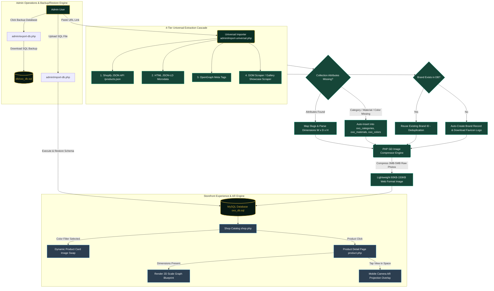

# 💎 OXO Control Studio — Luxury Furniture E-Commerce Engine

> **Live Technical Documentation & System Architecture Guide**  
> *Last Updated: July 28, 2026 — 8:14 AM*

---

## 📊 Live System Statistics
- **Total Catalog Products:** `13`
- **Partner Brands:** `6`
- **Categories:** `7`
- **Materials:** `7`
- **Color Palettes:** `17`
- **Client Inquiries:** `5`

---

## 🔀 Project Workflow & Execution Flowchart

---

## 🛠️ Core Features & Technical Architecture

### 1. Universal Product Importer (`admin/import-universal.php`)
- **4-Tier Extraction Cascade**: Fallback scraper extracts title, price, description, and high-res images from any furniture site.
- **Showcase Gallery Scrape**: Parses category showcase pages into a **Batch Review Grid**.
- **Auto-Deduplication**: Automatically maps brand domains, reuses existing brand records, and downloads company logos.

### 2. Image Optimization Engine (`compress_and_save_image()`)
- Uses PHP GD library to resize and compress 3MB–5MB raw images down to **60KB – 150KB**.

### 3. Database Backup & Restore (`admin/export-db.php` & `admin/import-db.php`)
- 1-Click database dump downloads `oxo_db.sql` directly.
- SQL Upload Importer validates and restores schema/rows seamlessly.
